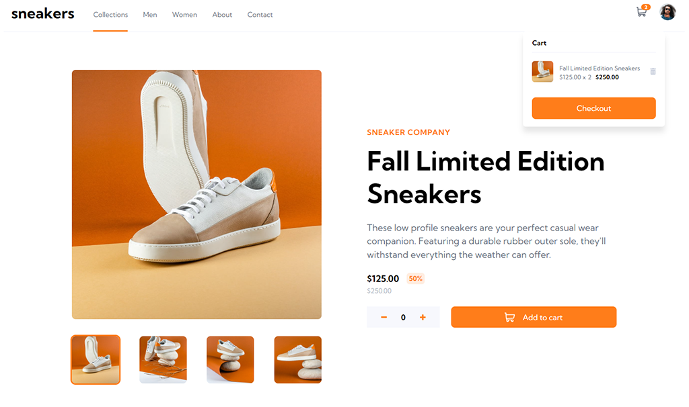
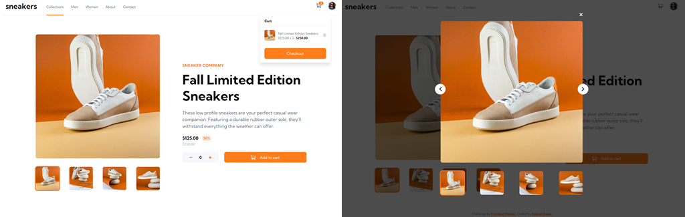
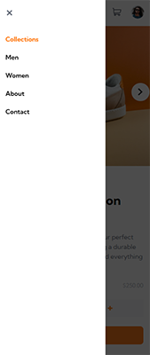

# Frontend Mentor - E-Commerce Challenge

Challenge do Frontend Mentor para a criação de uma página de produto responsiva com carrinho funcional.
 
 
 

# 📄 Sobre a aplicação

Para completar o desafio, era preciso seguir o design mobile e desktop, incluindo um modal para visualização das fotos do produto, bem como interações do usuário com o menu (efeitos visuais) e o carrinho (funcionalidades de adicionar e remover itens).

O app foi desenvolvido em ReactJS.
 
 

## Meus complementos

A challenge não exigia, mas para tornar a página verdadeiramente dinânimica passei os dados do produto para um arquivo `JSON`. Depois, adicionei rotas dinâmicas com `react-router-dom` utilizando o parâmetro `id` na página `Product`.
 
 
Assim, é possível adicionar qualquer produto com id único no products.json, e ele será acessível pelo path`/product/id`.

 
 

# 📷 Screenshots

 

 
 

# 🌎 Acesso

A aplicação está hospedada no Github Pages e pode ser acessada neste [link](https://g-pg-frontendmentor-ecommerce.netlify.app/product/1).
